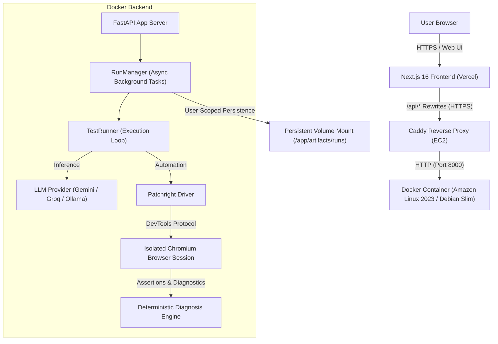

# TraceKit

> **AI web testing that acts, verifies, and explains.**

TraceKit is an autonomous browser testing agent designed to eliminate the fragility of traditional end-to-end test maintenance. By pairing multimodal LLM reasoning with deterministic browser automation and assertions, TraceKit turns plain-English test objectives into verifiable browser interactions, structured execution traces, and inspectable artifact reports.

**Core Thesis**: *LLMs decide what to do; deterministic browser assertions decide whether it actually worked.*

---

## Why TraceKit?

Traditional end-to-end testing frameworks (Playwright, Cypress, Selenium) are powerful but suffer from recurring maintenance overhead:
- **Brittle Selectors & UI Drift**: Subtle DOM restructuring, renamed classes, or adjusted layouts frequently break hardcoded CSS/XPath locators even when application logic remains correct.
- **Expensive Workflow Maintenance**: Engineering teams spend substantial time updating scripts for trivial workflow changes rather than catching genuine bugs.
- **The "Subjective AI" Trap**: Relying purely on an LLM to evaluate visual screenshots or DOM states often produces hallucinations—grading a broken checkout as "passing" because it "looks plausible."

TraceKit addresses these problems through architectural separation:
1. **Planning & Interaction**: The LLM inspects the accessibility tree and interactive controls to reason through user flows and select discrete browser actions.
2. **Deterministic Verification**: Outcomes are never validated by model speculation. Conditions (visibility, text values, disabled states, element counts) are verified directly against Chromium DOM APIs using Playwright assertions.
3. **Transparent Evidence**: Every execution step emits structured timing, locators, full-resolution screenshots, and root-cause failure classification.

---

## How It Works

TraceKit operates on an autonomous **Observe → Reason → Act → Verify → Report** execution cycle:

```
User Goal (URL + Plain-English Objective)
   │
   ▼
1. OBSERVE   ──► Captures clean DOM accessibility snapshot, interactive locators & screenshot
   │
   ▼
2. REASON    ──► LLM analyzes current state against goal and historical steps; plans next action
   │
   ▼
3. ACT       ──► ActionDispatcher executes action in Patchright Chromium (click, fill, hover, etc.)
   │
   ▼
4. VERIFY    ──► Evaluates deterministic Playwright expect assertion directly against Chromium DOM
   │
   ▼
5. REPORT    ──► Records step trace, visual diffs, timings, and failure diagnosis report
```

### Structured Step Trace
Each execution step records a 4-part structured log:
- **`observation`**: URL, document title, and semantic accessibility snapshot of visible interactable elements.
- **`decision`**: Concise natural-language intent explaining why the action was selected.
- **`action`**: Strictly typed Pydantic action with resolved locator criteria and payload.
- **`result`**: Status, execution duration (ms), locator resolution strategy, and DOM verification outcome.

---

## Architecture



### Frontend / Backend Separation
- **Frontend ([frontend/](file:///c:/Users/HP/Desktop/testing-agent_v0/frontend/))**: Next.js 16 (React 19, Tailwind CSS 4) web interface. Manages test launching, live run streaming, interactive screenshot lightboxes, runs history, documentation, and appearance settings. Proxies all API requests to the backend via Next.js rewrites.
- **Backend ([backend/](file:///c:/Users/HP/Desktop/testing-agent_v0/backend/))**: Python 3.11 FastAPI server running Uvicorn. Manages execution lifecycles (`RunManager`), user-isolated artifact storage, Google OAuth sessions, LLM client connections, Patchright Chromium browser instances, and deterministic failure diagnosis.

---

## What It Can Do

### Browser Actions
TraceKit supports 9 strictly typed Pydantic browser action models:
- **`click`**: Clicks a targeted element with customizable button (`left`, `right`, `middle`) and click count.
- **`fill`**: Focuses and types text into input fields, textareas, or search boxes.
- **`navigate`**: Navigates the browser page to a target HTTP/HTTPS URL.
- **`assert`**: Triggers a deterministic DOM verification against an element or page state.
- **`press_key`**: Dispatches keyboard events (`Enter`, `Escape`, `Tab`, `ArrowDown`, `ArrowUp`, `Backspace`).
- **`select`**: Selects options in native HTML `<select>` controls by visible label or value.
- **`scroll`**: Scrolls viewport up or down by specified pixel increments.
- **`hover`**: Hovers over elements to trigger flyout menus, tooltips, or hover states.
- **`finish`**: Concludes the test run signaling successful goal fulfillment or unrecoverable blocker.

### Deterministic Assertions
Assertions evaluate directly through Playwright/Patchright `expect` authority rather than model opinion:
- **`visible`**: Confirms an element is present and visible in the DOM.
- **`hidden`**: Confirms an element is absent or non-visible.
- **`has_text`**: Confirms an element contains expected text.
- **`has_value`**: Confirms form control holds expected input value.
- **`has_url`**: Page-level assertion matching current browser URL.
- **`has_title`**: Page-level assertion matching document title.
- **`enabled`**: Confirms an interactive control is not disabled.
- **`disabled`**: Confirms an element is disabled or inactive.
- **`checked`**: Confirms an input checkbox/toggle is checked.
- **`unchecked`**: Confirms an input checkbox/toggle is unchecked.
- **`has_count`**: Confirms exact non-negative integer count of matched DOM elements.

### Locator Resolution Ladder
When interacting with elements, TraceKit uses a prioritized resolution ladder:
1. **CSS Selector / `data-testid`**: Takes precedence whenever an explicit selector is provided.
2. **Role + Accessible Name**: (e.g. `role="button", name="Add to cart"`) — primary accessible target.
3. **Exact or Partial Text**: (e.g. `text="Checkout"`) — matches visible rendered strings.
4. **Placeholder Attribute**: (e.g. `placeholder="Search items"`) — matches input placeholders.
5. **Associated Label**: (e.g. `label="Password"`) — resolves inputs via associated form `<label>` tags.
6. **Disambiguation Index**: (e.g. `index=0`) — 0-based integer to disambiguate and select an exact element when multiple matching elements share identical criteria.

### Failure Diagnosis Engine
When a run terminates in failure, the diagnosis engine ([backend/app/diagnosis.py](file:///c:/Users/HP/Desktop/testing-agent_v0/backend/app/diagnosis.py)) automatically classifies the root cause:

#### 1. `APPLICATION_BEHAVIOR_MISMATCH`
The target web application failed or behaved unexpectedly:
- **`APPLICATION_CRASH`**: Target site threw uncaught JavaScript errors or returned HTTP 5xx responses.
- **`ASSERTION_FAILED`**: A deterministic assertion failed (e.g., checkout button remained disabled).
- **`EXPECTED_STATE_NOT_REACHED`**: Step budget exhausted before reaching terminal objective.

#### 2. `AUTOMATION_FAILURE`
The test runner encountered an environment or reasoning barrier:
- **`NAVIGATION_ERROR`**: Target URL failed DNS resolution, refused connection, or timed out.
- **`PROVIDER_ERROR`**: LLM API key error, rate limit (HTTP 429), or context failure.
- **`SESSION_ERROR`**: Browser session initialization failed or crashed.
- **`LOCATOR_NOT_FOUND`**: Specified locator criteria matched zero DOM elements.
- **`BUDGET_EXCEEDED`**: Max steps reached without an application or assertion error.
- **`TIMEOUT`**: Action execution exceeded strict timeout threshold.

---

## Evidence & Reports

Every run persists complete, inspectable evidence packages:
- **`report.json`**: Full machine-readable record including timestamps, durations, structured step traces, locator strategies, raw LLM outputs, and diagnostic classifications.
- **`report.md`**: Human-readable GitHub-flavored Markdown report summarizing objectives, execution logs, and verdicts.
- **`trace.zip`**: Complete Playwright Trace Viewer archive containing full DOM snapshots, action timelines, console logs, and network traffic. Viewable at [trace.playwright.dev](https://trace.playwright.dev).
- **`screenshots/`**: Timestamped full-resolution PNG images captured before and after each browser interaction.

---

## LLM Providers

TraceKit integrates multiple inference providers without vendor lock-in:

| Provider | Default Model | Additional Curated Models | Notes |
| :--- | :--- | :--- | :--- |
| **Google Gemini** | `gemini-3.6-flash` | `gemini-2.5-flash`, `gemini-2.5-pro` | Primary cloud provider; fast multimodal DOM reasoning. |
| **Groq** | `openai/gpt-oss-120b` | `openai/gpt-oss-20b`, `qwen/qwen3.6-27b` | Ultra-low latency LPU inference. |
| **Ollama** | `qwen2.5-coder:3b` | `llama3.2:3b` | Self-hosted, air-gapped local inference. |
| **Auto (Fallback)** | *Priority Cascade* | — | Automatically cascades across configured providers upon rate limits (429) or timeouts. |

---

## Authenticated Testing

TraceKit distinguishes between **TraceKit platform authentication** and **target website authentication**:

1. **TraceKit Platform Authentication**: Users sign into the TraceKit workspace using Google OAuth 2.0 with PKCE state verification. Authenticated sessions are managed via signed, HttpOnly `tracekit_session` cookies.
2. **Target Website Authentication**: TraceKit supports testing post-login flows on external websites without writing password credentials into prompts. In Advanced Settings, users can provide Playwright-compatible `storage_state` JSON (cookies and localStorage tokens). The browser context initializes with this state, immediately loading authenticated dashboards or checkout flows.

---

## User Isolation

TraceKit enforces multi-tenant boundary isolation across the application:
- **Ownership Chain**: `Google OAuth sub` → `TraceKit User` → `Run.owner_id` → `artifacts/runs/<user_id>/<run_id>/`.
- **Protected Run Endpoints**: `GET /api/runs` and `GET /api/runs/{run_id}` verify that the session user matches `owner_id`.
- **Artifact Traversal Protection**: The artifact server validates that requested paths reside strictly within `artifacts/runs/<user_id>/<run_id>/`. Any attempt to traverse parent directories (`..`, absolute paths, root prefixes) returns `404 Not Found`.
- **Cross-User Privacy**: Users cannot query, list, or download runs belonging to another user.

---

## Production Architecture

TraceKit is deployed across a secure edge-and-cloud architecture:

```
[ User Browser ]
       │
       │ HTTPS
       ▼
[ Vercel Edge ] (Next.js 16 Frontend)
       │
       │ HTTPS (Rewrite /api/* via BACKEND_URL)
       ▼
[ Caddy Reverse Proxy ] (AWS EC2)
       │  • Automatic TLS via Let's Encrypt / sslip.io
       │  • Port 8000 closed to public internet
       │ HTTP (localhost:8000)
       ▼
[ Docker Container ] (tracekit-backend:latest)
       │  • FastAPI / Uvicorn (Single Worker)
       │  • Patchright + Isolated Headless Chromium
       ▼
[ Host Persistent Volume ] (/opt/tracekit/artifacts ↔ /app/artifacts/runs)
```

### Production Infrastructure Facts
- **Frontend**: Deployed on Vercel Serverless/Edge network.
- **Backend Host**: AWS EC2 `t3.small` (2 vCPU, 2 GiB RAM) in `ap-south-1` running Amazon Linux 2023.
- **Web Server**: Caddy terminates public HTTPS, proxying requests to Docker on localhost.
- **Execution Model**: Single Uvicorn process running Python 3.11; Patchright manages headless Chromium instances.
- **Persistence**: Host bind-mount preserves run reports, traces, and screenshots across container restarts.

---

## Local Development

### Prerequisites
- **Node.js**: v20.x or higher
- **Python**: v3.11 or higher
- **Git**

### 1. Backend Setup
```bash
cd backend

# Create and activate virtual environment
python -m venv .venv

# On Windows:
.venv\Scripts\activate
# On macOS/Linux:
source .venv/bin/activate

# Install dependencies in editable mode
pip install -e .

# Install Patchright Chromium browser and system dependencies
python -m patchright install --with-deps chromium

# Configure environment variables
cp .env.example .env
# Edit .env with your provider API keys and session secret

# Start FastAPI development server
python -m uvicorn app.server:app --reload --host 127.0.0.1 --port 8000
```

### 2. Frontend Setup
```bash
cd frontend

# Install dependencies
npm install

# Start Next.js development server
npm run dev
```

Open [http://localhost:3000](http://localhost:3000) in your browser. Local frontend API requests automatically proxy to the backend at `http://127.0.0.1:8000` via Next.js rewrites.

---

## Environment Variables

### Backend (`backend/.env`)
```bash
# LLM Provider Keys (at least one required for cloud inference)
GEMINI_API_KEY=
GEMINI_MODEL=gemini-3.6-flash
GROQ_API_KEY=
OLLAMA_HOST=http://localhost:11434

# Session & Security
SESSION_SECRET_KEY=     # Generate with: python -c "import secrets; print(secrets.token_hex(32))"
ENVIRONMENT=development # "development" or "production"
ARTIFACTS_DIR=          # Optional override; defaults to artifacts/runs

# Google OAuth 2.0 (Required for authenticated user sessions)
GOOGLE_CLIENT_ID=
GOOGLE_CLIENT_SECRET=
GOOGLE_REDIRECT_URI=http://localhost:3000/api/auth/google/callback
```

### Frontend (`frontend/.env.local`)
```bash
# Destination backend URL for Next.js /api/* proxy rewrite
BACKEND_URL=http://127.0.0.1:8000
```

> **Security Note**: Never commit `.env` or `.env.local` files to version control. Production secrets must be configured directly within deployment environment settings.

---

## Docker

The backend includes a production-ready Debian-based Dockerfile ([backend/Dockerfile](file:///c:/Users/HP/Desktop/testing-agent_v0/backend/Dockerfile)).

### Build and Run Container Locally
```bash
# Build Docker image
docker build -t tracekit-backend ./backend

# Run container with environment configuration and persistent artifacts
docker run -d \
  --name tracekit-backend \
  -p 8000:8000 \
  --env-file backend/.env \
  -v "$(pwd)/artifacts:/app/artifacts/runs" \
  tracekit-backend
```

---

## Continuous Integration

The repository includes a containerized smoke-test workflow in [.github/workflows/docker-smoke-test.yml](file:///c:/Users/HP/Desktop/testing-agent_v0/.github/workflows/docker-smoke-test.yml):
1. Checks out repository code on `ubuntu-latest`.
2. Builds the backend Docker image (`docker build -t tracekit-backend:test ./backend`).
3. Starts the container with `ENVIRONMENT=production`.
4. Executes a bounded polling loop against `GET /api/health`, asserting `status == "ok"` and `environment == "production"`.
5. Executes an inline Patchright Chromium test inside the running container, navigating to `https://example.com` and validating document title assertions.
6. Tears down and cleans up container resources.

---

## Testing & Verification

### Backend Automated Test Suite
The backend contains 352 automated unit and integration tests covering agent reasoning, browser actions, deterministic assertions, failure diagnosis classification, OAuth sessions, and artifact security.

```bash
cd backend
pytest -q
# Output: 352 passed in ~11s
```

### Frontend Validation
```bash
cd frontend
npm run lint   # ESLint checks (0 errors, 0 warnings)
npm run build  # Next.js production bundle build
```

---

## Example Workflow

Here is an example test execution verifying e-commerce checkout behavior on SauceDemo:

1. **Launch Test**: In Test Studio, enter `https://www.saucedemo.com` and input:
   > *"Log in as standard_user, add the backpack to the cart, and verify the checkout button is enabled."*
2. **Execution Steps**:
   - `navigate(url="https://www.saucedemo.com")` → HTTP 200 OK.
   - `fill(placeholder="Username", value="standard_user")` → resolved via placeholder.
   - `fill(placeholder="Password", value="secret_sauce")` → resolved via placeholder.
   - `click(role="button", name="Login")` → resolved via role+name.
   - `click(selector="[data-test='add-to-cart-sauce-labs-backpack']")` → resolved via explicit selector.
   - `click(role="link", name="Shopping Cart")` → resolved via role+name.
   - `assert(assertion_type="enabled", role="button", name="Checkout")` → **PASSED** (deterministic expect).
   - `finish(success=true, message="Checkout button verified enabled after adding backpack.")`
3. **Review**: Inspect chronological steps, DOM timings, full-resolution screenshots, and the generated `report.md` summary.

---

## Design Principles

- **LLMs for Reasoning, Not Truth**: Models identify interactive opportunities; Playwright Chromium APIs determine assertion validity.
- **Evidence Over Opaque Verdicts**: Every run generates verifiable DOM snapshots, timelines, and screenshots.
- **Explicit Failure Classification**: Differentiates application bugs from automation issues to prevent false alarms.
- **User-Scoped Isolation**: Multi-tenant boundaries with path-traversal protection.
- **Practical Engineering**: Focused single-worker architecture and deterministic primitives rather than excessive infrastructure layers.

---

## Current Boundaries

TraceKit is designed as a focused, robust developer-tool MVP for autonomous web verification:
- **Single Uvicorn Worker**: The backend currently runs as a single Uvicorn process to prevent concurrent Chromium session memory exhaustion on `t3.small` (2 GiB RAM).
- **In-Memory Active Run State**: In-flight run handles are tracked in memory by `RunManager` during execution; completed run metadata and reports persist directly to the filesystem.
- **Filesystem-Based Artifact Storage**: Run reports, screenshots, and trace bundles are stored on local/mounted disk volumes rather than cloud object storage (S3/GCS).
- **Single Browser Engine**: Automation targets Patchright Chromium; Firefox and WebKit are not currently in the active execution matrix.

---

## Future Work

Potential roadmap directions beyond the challenge scope:
- Distributed background execution via Celery or Redis queues.
- S3 / GCS cloud object storage driver for artifact bundles.
- Persistent database backend (PostgreSQL / SQLite) for run history and metrics.
- Cross-browser test matrix (Chromium, Firefox, WebKit).
- Automated visual regression diffing between baseline and candidate runs.

---

## Project Structure

```
testing-agent_v0/
├── .github/
│   └── workflows/
│       └── docker-smoke-test.yml   # Container CI smoke test
├── backend/
│   ├── app/
│   │   ├── agent/                  # Orchestrator and decision parsing
│   │   ├── auth/                   # Google OAuth and JWT sessions
│   │   ├── browser/                # Patchright driver, actions, and DOM observer
│   │   ├── llm/                    # Gemini, Groq, Ollama, and fallback providers
│   │   ├── models/                 # Pydantic action and assertion schemas
│   │   ├── diagnosis.py            # Failure diagnosis engine
│   │   ├── reporting.py            # JSON/Markdown report generators
│   │   ├── runner.py               # TestRunner execution coordinator
│   │   └── server.py               # FastAPI app and RunManager
│   ├── tests/                      # 352 automated pytest test suites
│   ├── Dockerfile                  # Production Debian-based container definition
│   ├── pyproject.toml              # Python project metadata and dependencies
│   └── README.md                   # Backend-specific developer documentation
├── frontend/
│   ├── app/                        # Next.js App Router pages
│   ├── components/                 # Reusable React components (shell, run, test)
│   ├── context/                    # AuthContext and ThemeContext
│   ├── lib/                        # API client and utilities
│   ├── next.config.ts              # API rewrite configuration
│   └── package.json                # Frontend dependencies and scripts
└── artifacts/                      # Base directory for user-scoped test runs
```
